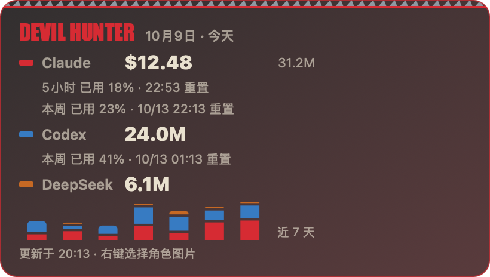
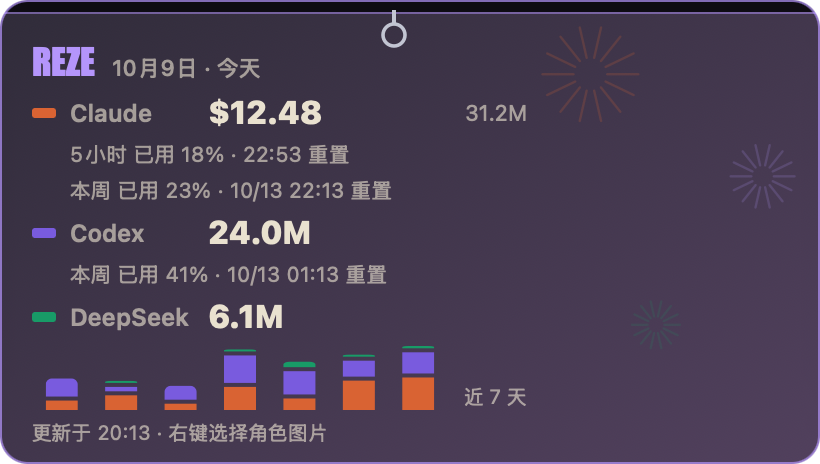

# claude-usage

See how many tokens and dollars you spend on **Claude Code**, plus **Codex** and
**DeepSeek (via Hermes)**, from the logs already on your Mac. Nothing is sent
anywhere.

- `claude-usage report`: a cost report in the terminal
- `claude-usage serve`: a live local dashboard at http://127.0.0.1:8899
- **Desktop widget** (macOS): a translucent card on your desktop with today's
  usage, the last 7 days, and your Claude 5-hour / weekly limits and Codex
  weekly limit with reset times

| Chainsaw theme | Reze theme |
|---|---|
|  |  |

[中文说明](#中文说明)

## Install

### Quick: download the app

1. Install the CLI: `pipx install git+https://github.com/zhixuanlucasfeng-cmyk/claude-usage.git`
   (or `python3 -m pip install --user git+https://github.com/zhixuanlucasfeng-cmyk/claude-usage.git`)
2. Download `ClaudeUsageWidget-macOS.zip` from
   [Releases](https://github.com/zhixuanlucasfeng-cmyk/claude-usage/releases/latest),
   unzip it and move the app to Applications.
3. The app is not notarized, so the first time, right-click it → Open → Open.

For Claude plan limits on the widget, also set up the status line (step 3 of
the installer below, or copy `widget/usage-statusline.sh` yourself).

### From source

Requirements: macOS 13+, Python 3.10+, Xcode Command Line Tools
(`xcode-select --install`), and `jq` (built into macOS 15+, otherwise
`brew install jq`).

    git clone https://github.com/zhixuanlucasfeng-cmyk/claude-usage.git
    cd claude-usage
    ./install.sh

The installer:

1. creates `venv/` in this folder and installs the CLI;
2. builds `Claude Usage Widget.app` into `~/Applications` and opens it;
3. adds a Claude Code status line that saves your plan limits for the widget.
   If you already have a `statusLine`, it leaves it alone.

The widget runs the CLI from this folder, so keep the folder where it is. To
start the widget at login, add the app under System Settings → General →
Login Items.

CLI only (any OS):

    pip install -e .
    claude-usage report --days 7

## The widget

- Drag it anywhere. It sits just below normal windows, so it never covers your
  work.
- Right-click for: full dashboard, theme, zoom in / zoom out / actual size,
  character image, background video, quit. You can also pinch on a trackpad to
  resize it.
- **Character art**: no artwork ships with this repo. Pick your own image with
  right-click → 选择角色图片. A PNG with a transparent background stands on
  the card and pokes out of the top; any other image is shown inset.
- **Background video**: pick any clip; it loops muted behind a tint that keeps
  the numbers readable.
- Double-click to open the full dashboard.

## Where the numbers come from

| Source | File | What |
|---|---|---|
| Claude Code | `~/.claude/projects/**/*.jsonl` | tokens and estimated cost |
| Claude plan limits | written by `widget/usage-statusline.sh` | 5-hour and weekly % used and reset time |
| Codex | `~/.codex/sessions/**/*.jsonl` | tokens and weekly limit |
| DeepSeek | `~/.hermes/state.db` (read-only) | tokens |

- Cost is estimated from a hardcoded price table in
  `claude_usage/pricing.py`. Update it when prices change. Codex and DeepSeek
  show tokens only.
- Claude Code only exposes plan limits to status line scripts, so the widget's
  Claude limits update only while Claude Code is open. When they are older than
  30 minutes, the widget says so.
- Claude Code copies earlier turns into a new log file when a session is
  resumed, forked or compacted. Calls are deduplicated by message and request
  ID, which roughly halves the raw count.
- The server listens on `127.0.0.1` only, because the dashboard lists your
  project paths.

## Development

    pip install -e ".[dev]"
    pytest
    widget/build.sh        # rebuild the widget

## 中文说明

读取你 Mac 上已有的日志，统计 **Claude Code**、**Codex**、**DeepSeek（Hermes）**
用了多少 token、花了多少钱。所有数据都在本地，不上传。

- `claude-usage report`：终端里的费用报告
- `claude-usage serve`：本地实时统计网页 http://127.0.0.1:8899
- **桌面小组件**：半透明卡片，显示今天的用量、近 7 天、Claude 5 小时 / 本周额度和
  Codex 本周额度（已用百分比和重置时间）

**安装**：最简单是先 `pipx install git+https://github.com/zhixuanlucasfeng-cmyk/claude-usage.git`，
再到 [Releases](https://github.com/zhixuanlucasfeng-cmyk/claude-usage/releases/latest) 下载
`ClaudeUsageWidget-macOS.zip`，解压后第一次右键 → 打开。

或者从源码安装（需要 macOS 13+、Python 3.10+、Xcode 命令行工具、jq）：

    git clone https://github.com/zhixuanlucasfeng-cmyk/claude-usage.git
    cd claude-usage
    ./install.sh

**用法**：

- 拖动可以移动位置。
- 右键菜单：完整统计、主题（电锯人 / 蕾塞）、放大 / 缩小 / 原始大小、角色图片、
  背景视频、退出。触控板双指捏合也能缩放。
- 仓库里不附带任何角色图片。右键「选择角色图片」用你自己的图，透明背景的 PNG
  效果最好。
- 双击打开完整统计。

## License

MIT
